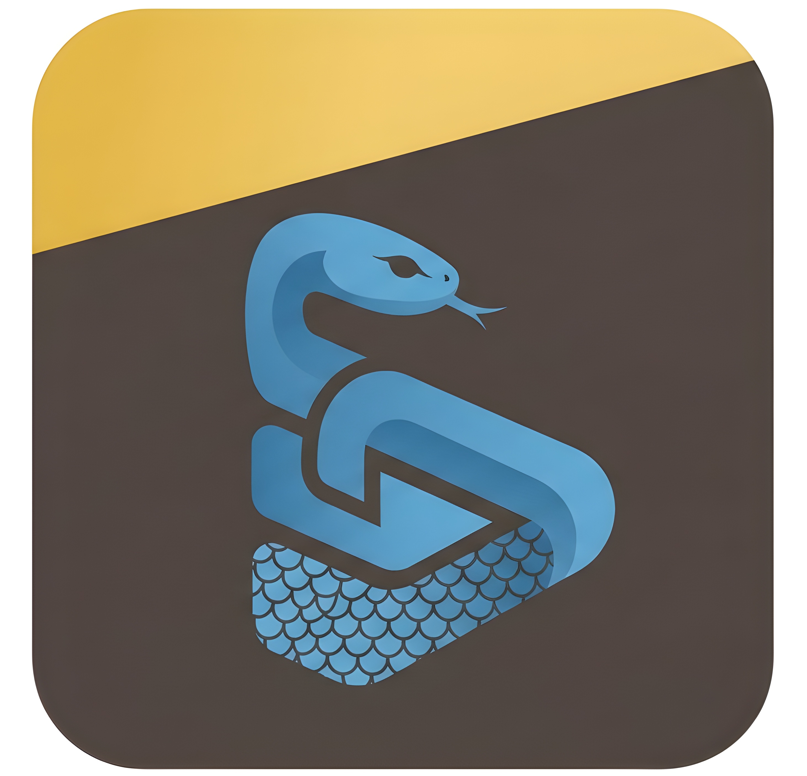

# <picture>
  <source media="(prefers-color-scheme: dark)" srcset="assets/logo.png">
  <source media="(prefers-color-scheme: light)" srcset="assets/logo.png">
  
</picture> garmin-ble

[](https://pypi.org/project/garmin-ble/)
[](https://pypi.org/project/garmin-ble/)
[](https://www.gnu.org/licenses/agpl-3.0)

A clean-room Python implementation of Garmin's proprietary BLE protocol (GFDI V2), reverse-engineered from [Gadgetbridge](https://codeberg.org/Freeyourgadget/Gadgetbridge). Stream live telemetry from your Garmin watch directly to your computer — no cloud, no phone, no Garmin Connect required.

---

## Features

- **Live Telemetry** — stream real-time sensor data over BLE without Garmin Connect:
  - ❤️ Heart Rate & Resting Heart Rate
  - 🚶 Daily Steps & Goal
  - 📊 Heart Rate Variability (HRV)
  - 🫁 Blood Oxygen (SpO2)
  - 🌬️ Respiration Rate
- **Protocol Decoding** — full implementation of the Garmin GFDI V2 stack:
  - Automated handshake (`CLOSE_ALL`, `REGISTER_ML`)
  - MLR (Multi-Link Routing) packet multiplexing
  - COBS (Consistent Overhead Byte Stuffing) encoding/decoding
  - Compiled Protobufs for `gdi_smart_proto`
  - CRC16 integrity checking
- **Hackable** — pure Python, no binary blobs, no proprietary SDKs

---

## Installation

```bash
pip install garmin-ble
```

Or install from source with dev dependencies:

```bash
git clone https://github.com/gwerneckp/garmin-ble.git
cd garmin-ble
pip install -e ".[dev]"
```

---

## Quick Start

```python
import asyncio
from garmin_ble import GarminClient

def on_heart_rate(hr, resting_hr):
    print(f"❤️  {hr} BPM (Resting: {resting_hr} BPM)")

async def main():
    client = GarminClient()
    client.on("hr", on_heart_rate)

    if await client.connect():
        print("Connected! Streaming data...")
        await client.start_sync_loop()

asyncio.run(main())
```

> [!TIP]
> Make sure your watch is **not** connected to your phone via Bluetooth — Garmin watches only allow one BLE connection at a time.

See the [`examples/`](./examples/) directory for more usage.

---

## Status & Roadmap

| Phase | Goal | Status |
|-------|------|--------|
| 1 | 🏗️ BLE transport & handshake | ✅ Done |
| 2 | 📡 Live telemetry streaming | ✅ Done |
| 3 | 🧠 Protobuf settings & device state | 🔄 In progress |
| 4 | 🔔 Notifications & media control | ⏳ Planned |
| 5 | 📁 File transfers (FIT / GPX downloads) | ⏳ Planned |
| 6 | 🗄️ Persistence & dashboard | ⏳ Planned |

See [`ROADMAP.md`](./ROADMAP.md) for the full breakdown.

---

## Project Mission

**Own your data.** Garmin devices capture a wealth of physiological data, but Garmin Connect locks it behind a cloud service. This library gives you direct, programmatic access to your watch over BLE — no internet required.

---

## Acknowledgements & License

This project builds on the extraordinary reverse-engineering work of the [Gadgetbridge](https://codeberg.org/Freeyourgadget/Gadgetbridge) team. The protocol logic, COBS decoding, and `.proto` schemas are derived from their open-source Java implementation.

Licensed under the **GNU Affero General Public License v3.0 (AGPL-3.0)** — see [`LICENSE`](./LICENSE) for details.
