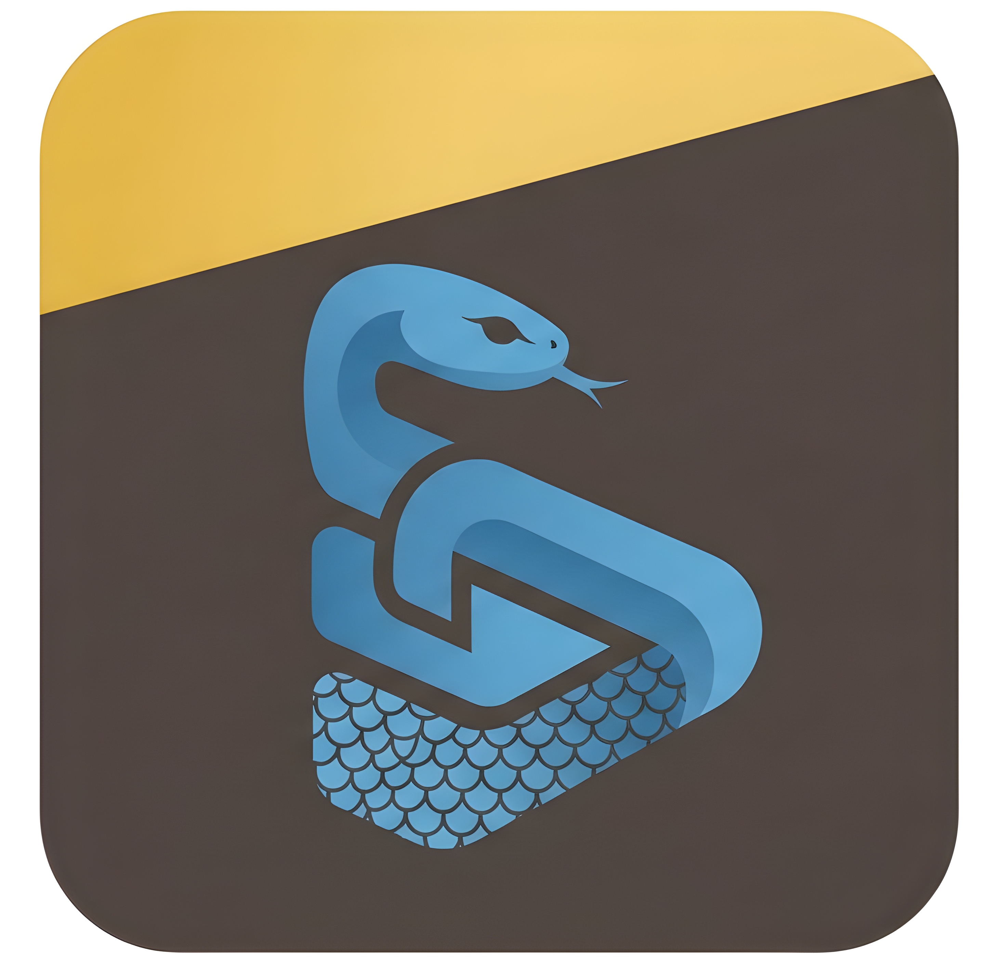

# <picture>
  <source media="(prefers-color-scheme: dark)" srcset="assets/logo.png">
  <source media="(prefers-color-scheme: light)" srcset="assets/logo.png">
  
</picture> garmin-ble

[](https://pypi.org/project/garmin-ble/)
[](https://pypi.org/project/garmin-ble/)
[](https://www.gnu.org/licenses/agpl-3.0)

A clean-room Python implementation of Garmin's proprietary BLE protocol (GFDI V2). Stream live telemetry from your Garmin watch directly to your computer: no cloud, no phone, no Garmin Connect required.

---

## Features

- **Live Telemetry** — stream real-time sensor data over BLE without Garmin Connect:
  - ❤️ Heart Rate & Resting Heart Rate
  - 🚶 Daily Steps & Goal
  - 📊 Heart Rate Variability (HRV)
  - 🫁 Blood Oxygen (SpO2)
  - 🌬️ Respiration Rate
  - 🔥 Calories (total & active)
  - ⚡ Intensity Minutes
  - 🧘 Stress Level
  - 🔋 Body Battery
  - ⌚ Accelerometer
- **Typed Metrics** — every reading is a dataclass with named fields, not positional tuples
- **On-Demand Service Registration** — subscribing to a metric starts its service; the last unsubscribe stops it
- **Protocol Decoding** — full implementation of the Garmin GFDI V2 stack:
  - Automated handshake (`CLOSE_ALL`, `REGISTER_ML`)
  - MLR (Multi-Link Routing) packet multiplexing
  - COBS (Consistent Overhead Byte Stuffing) encoding/decoding
  - Compiled Protobufs for `gdi_smart_proto`
  - CRC16 integrity checking
- **Automatic Reconnection** — survives BLE drops with exponential backoff and restores subscriptions
- **Keep-Alive Heartbeat** — periodic time-sync to maintain the link
- **Simulator & Replay** — develop, test, and reproduce bugs with no hardware
- **Frame Tracing** — per-session capture files and live protocol diagnostics
- **Hackable** — pure Python, no binary blobs, no proprietary SDKs

---

## Installation

```bash
pip install garmin-ble
```

Or install from source with dev dependencies:

```bash
git clone https://github.com/gwerneckp/garmin-ble.git
cd garmin-ble
pip install -e ".[dev]"
```

---

## Quick Start

```python
import asyncio
from garmin_ble import Watch, metrics

async def main():
    async with Watch.discover() as watch:
        print(f"Connected to {watch.info.name}")

        async for reading in watch.stream(metrics.HEART_RATE):
            print(f"❤️  {reading.bpm} BPM (resting {reading.resting_bpm})")

asyncio.run(main())
```

The session owns connecting, the GFDI handshake, the keep-alive heartbeat, and
reconnection — and leaving the block always disconnects, including on `Ctrl+C`.
Subscribing to a metric registers and starts its service on the watch; the last
unsubscribe stops it.

Prefer callbacks? Both sync and `async def` handlers work:

```python
@watch.on(metrics.HEART_RATE)
async def _(reading: metrics.HeartRate) -> None:
    await store(reading.bpm)
```

### No watch on hand

Swap the factory and the same code runs with no hardware — useful for
development, examples, and CI:

```python
async with Watch.simulated(profile="fenix7") as watch:   # in-process watch
async with Watch.replay("session.gble") as watch:        # a recorded session
```

`watch.record(path)` writes a capture that `Watch.replay` reads back, so a
protocol bug can be reproduced by someone who does not own the watch.

### Reading device state

```python
battery = await watch.battery()          # -> Battery(percent=88, status="ok")
result  = await watch.collect(timeout=60)  # one sample of every metric
print(result)                              # renders a ✅/⏳ checklist
```

Failures raise: `WatchNotFound` carries the devices the scan *did* see,
`HandshakeError` names the stage it stopped at, and `ServiceUnavailable` is
raised when the watch declines a metric rather than leaving a stream that never
yields.

> [!TIP]
> Make sure your watch is **not** connected to your phone via Bluetooth — Garmin watches only allow one BLE connection at a time. Run `python examples/scan.py` if discovery fails; it lists every device in range and says why none matched.

See the [`examples/`](./examples/) directory for complete usage patterns —
`telemetry_basic.py` (simplest start), `telemetry_advanced.py` (every stream at
once, reconnection, diagnostics), `device_state.py` (protobuf in both
directions), `full_walkthrough.py` (verify every feature), and
`accelerometer_3d.py` (live 3D orientation). Most accept `--simulate`.

---

## Status & Roadmap

See the [GitHub Issues](https://github.com/gwerneckp/garmin-ble/issues) for the
full breakdown of planned features, known gaps, and in-progress work. Milestones
map to release versions:

| Release | Goal | Status |
|---------|------|--------|
| v0.1.0 | 🏗️ BLE transport & handshake | ✅ Done |
| v0.2.0 | 📡 Live telemetry streaming | ✅ Done |
| v0.3.0 | ⌚ `Watch` API, transports, simulator & replay | ✅ Done |
| v0.4.0 | 🧠 Protobuf settings & device state | 🔄 In progress |
| v0.5.0 | 🔔 Notifications & media control | ⏳ Planned |
| v0.6.0 | 📁 File transfers (FIT / GPX downloads) | ⏳ Planned |
| v1.0.0 | 🗄️ Stable release | ⏳ Planned |

---

## Design Philosophy

`garmin-ble` is a **wire-protocol library**, not a feature-complete application. It knows how to encode, send, decode, and respond to Garmin's BLE protobufs — and nothing more.

This means:
- The library does **not** fetch weather from OpenWeatherMap, sync calendars via CalDAV, or play sounds when the watch says "find my phone".
- Instead it provides the building blocks — protobuf encode/decode, callbacks for incoming messages, and transport helpers.
- **Callers** wire up the OS integration, external APIs, and user-facing features.

This keeps the library focused, testable, and free of the endless feature creep that plagues integration-heavy projects.

**Consider using Gadgetbridge instead if:** you want a full-featured open-source replacement for the Garmin Connect app on your Android phone.

## Project Mission

**Own your data.** Garmin devices capture a wealth of physiological data, but Garmin Connect locks it behind a cloud service. This library gives you direct, programmatic access to your watch over BLE — no internet required.

---

## Acknowledgements & License

This project builds on the extraordinary reverse-engineering work of the [Gadgetbridge](https://codeberg.org/Freeyourgadget/Gadgetbridge) team. The protocol logic, COBS decoding, and `.proto` schemas are derived from their open-source Java implementation.

Licensed under the **GNU Affero General Public License v3.0 (AGPL-3.0)** — see [`LICENSE`](./LICENSE) for details.
